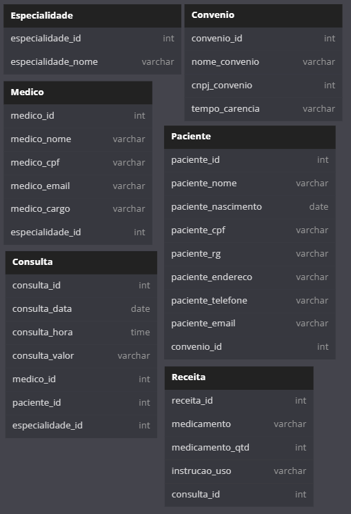
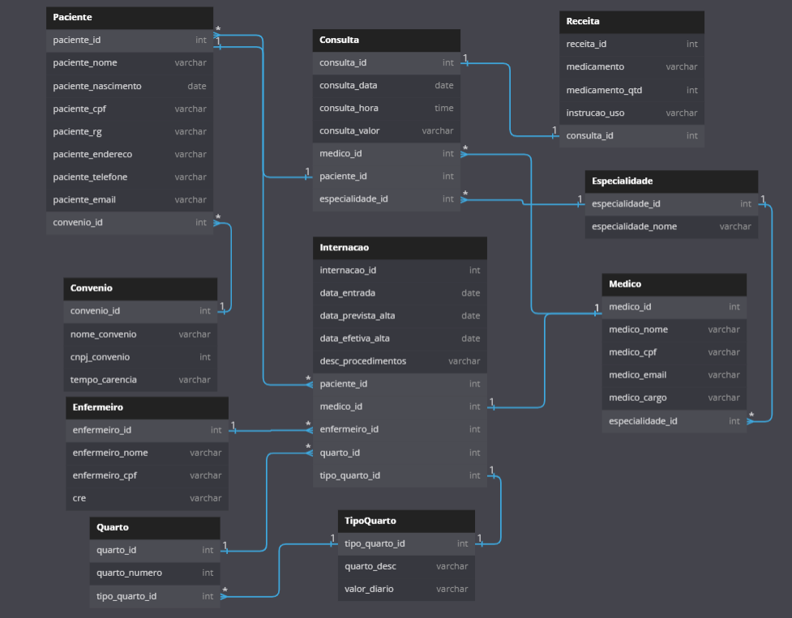

# Hotel para Terabithia
Olá! Bem vindo ao repositório do meu projeto de Banco de dados Hospital, uma atividade proposta pelo professor Gabriel Augusto no Instituto PROA.

## Sobre o projeto
<div>


</div>

### Descrição do projeto
Nesse projeto, deviamos fazer todo o processo de criar um diagrama, montar um banco de dados e fazer alterações nele quando necessário.

## Parte Um

### Construção do projeto
Para a realização do projeto, foram utilizados: dbdiagram e mySQL.

<div>
  <a href='https://www.mysql.com/](https://www.mysql.com/products/workbench/' target='_blank'>
    
  </a>
  <a href='https://dbdiagram.io/home'>
    dbdiagram
  </a>
</div>

## Como acessar o projeto?
### Acessando pelo computador

### Pré-requisitos

Para navegar no projeto no seu computador, é preciso ter instalado:

1. mySQL Workbench.

* mySQL Workbench
  ```sh
  https://www.mysql.com/products/workbench/
  ```

### Instalação

1. Baixe o respositório
2. Abra os arquivos 'criacao-bd-hospital' e 'consultas-bd-hospital' com o mySQL Workbench.
3. Execute os scripts na ordem acima com o mySQL Workbench.

### Importante!

Você pode inserir qualquer nome de usuario e de hotel, porém a senha para acessar é sempre: "2678".
